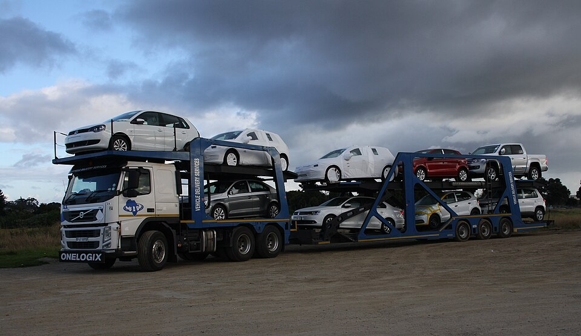
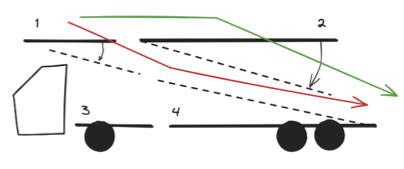

<!--
SPDX-FileCopyrightText: 2025 Luca Di Gaspero <luca.digaspero@uniud.it>

SPDX-License-Identifier: CC-BY-4.0
-->

# Auto Carrier Loading

Tommaso Urli, Satalia, UK  
Manuel López-Ibáñez, Alliance Manchester Business School, University of Manchester, UK  
Luca Di Gaspero, Università degli Studi di Udine, Italy  

Copyright 2025 Tommaso Urli, Manuel López-Ibáñez, Luca Di Gaspero.

This document is licensed under CC-BY-4.0.



## Introduction

The Auto Carrier Loading Problem arises in the automotive industry when moving vehicles (cars, vans, SUVs) across locations using transporters equipped with multiple configurable decks. This problem is of significant economic importance as efficient loading strategies can reduce transportation costs, minimise vehicle handling time, and reduce the risk of damage during transport.

The challenge involves determining how to assign vehicles to specific decks on the transporter while satisfying capacity constraints and deck accessibility requirements. Some decks can only be accessed by traversing other decks (see picture below), and these pathway decks must be empty for access to be possible. The problem becomes particularly complex when considering a fixed route with multiple stops where vehicles are loaded and unloaded at different locations.



The goal is to find feasible loading assignments that minimise the number of required deck traversals and/or the number of vehicles that need to be temporarily moved during loading/unloading operations.

## Task

Given a fixed route with specified vehicles to load and unload at each stop, determine the optimal assignment of vehicles to transporter decks that satisfies capacity and accessibility constraints while minimising traversal costs or vehicle handling operations.

## Detailed description

### Problem Parameters

A problem instance is characterised by:

- **Vehicles**: A set of vehicles, each with a single dimension value representing its size/length
- **Transporter**: A multi-deck carrier with:
  - Total capacity constraint
  - Individual deck capacities  
  - Deck accessibility relationships (some decks accessible only via specific other decks)
- **Route**: A fixed sequence of stops, each specifying which vehicles to load and/or unload

### Solution Representation

A solution specifies the deck assignment for each vehicle in the problem instance. This is represented as an array where the $i$-th element indicates the deck number assigned to the $i$-th vehicle.

In an extension of the problem, the solution will also include a sequence of operations performed at each stop, detailing which vehicles are loaded or unloaded and the possible new assignments to decks of the vehicles that are moved.

### Constraints

1) **Total Capacity Constraint**: The sum of the dimensions of all vehicles on the transporter must not exceed the total capacity at any point during the route
2) **Deck Capacity Constraint**: The sum of the dimensions of vehicles on each deck must not exceed that deck's capacity at any point during the route  
3) **Accessibility Constraint**: Vehicles can only be loaded onto or unloaded from a deck if at least one pathway to that deck is clear (i.e., all intermediate decks in the pathway are empty)

Constraints 1 and 2 are hard constraints that must be satisfied for feasibility. Constraint 3 can be modelled as either hard or soft, depending on the problem variant.

### Objective Functions

- Minimise the number of deck traversals required to load and unload all vehicles. Each vehicle incurs a cost equal to the number of decks traversed to reach its assigned deck.
- Minimise the total number of vehicle handling operations required. When a vehicle must be unloaded but its pathway is blocked, blocking vehicles must be temporarily moved, incurring a cost of 1 per moved vehicle. The objective is the sum of such costs across all stops.
- Minimise the repositionings, which is the total number of vehicles that change their deck assignment during the route. 

## Instance data file

The instance format is a JSON object with three main components:

```json
{
    "route": [
        {
            "load": ["vehicle_id1", "vehicle_id2"],
            "unload": ["vehicle_id3"]
        }
    ],
    "vehicles": {
        "vehicle_id": {
            "dimension": numeric_value
        }
    },
    "transporter": {
        "total_capacity": numeric_value,
        "decks": {
            "deck_id": {
                "capacity": numeric_value,
                "access_via": [["intermediate_deck1", "intermediate_deck2"]]
            }
        }
    }
}
```

- **route**: Array of route stops in execution order. Each stop can contain:
  - **load**: Array of vehicle IDs to be loaded at this stop (optional)
  - **unload**: Array of vehicle IDs to be unloaded at this stop (optional)
- **vehicles**: Object mapping vehicle IDs to their properties:
  - **dimension**: Numeric value representing the vehicle's size/length
- **transporter**: Object defining the carrier configuration:
  - **total_capacity**: Maximum total capacity across all decks
  - **decks**: Object mapping deck IDs to their properties:
    - **capacity**: Maximum capacity for this specific deck
    - **access_via**: Array of alternative access paths. Each path is an array of deck IDs that must be traversed (and empty) to reach this deck. If omitted, the deck is directly accessible.

## Solution file

The solution format for the basic version of the problem is a JSON array of integers representing deck assignments:

```json
[deck_number1, deck_number2, deck_number3, ...]
```

- The i-th element (0-indexed) represents the deck assignment for the i-th vehicle when vehicles are ordered by their keys in lexicographic order
- Deck numbers are integers starting from 1, corresponding to deck IDs "d1", "d2", "d3", etc.
- Example: if vehicles are {v1, v2, v3} and decks are {d1, d2, d3}, then [2, 1, 3] means v1→d2, v2→d1, v3→d3

For the extended version of the problem, the solution file will contain an array of objects, each representing a stop in the route with the following structure:

```json
[
    {
        "operations": [
            {
                "vehicle_id": "v1",
                "action": "load",
                "deck": 1
            },
            {
                "vehicle_id": "v2",
                "action": "unload",
                "deck": 2
            }
        ]
    },
    ...
]
```

## Example

### Instance

```json
{
    "route": [
        {
            "load": ["v1", "v2", "v3", "v4"]
        },
        {
            "unload": ["v2", "v3", "v4"],
            "load": ["v5", "v6", "v7"]
        },
        {
            "load": ["v8"]
        },
        {
            "unload": ["v1", "v5", "v6", "v7", "v8"]
        }
    ],
    "vehicles": {
        "v1": {"dimension": 1650},
        "v2": {"dimension": 900},
        "v3": {"dimension": 1700},
        "v4": {"dimension": 1100},
        "v5": {"dimension": 1450},
        "v6": {"dimension": 1250},
        "v7": {"dimension": 800},
        "v8": {"dimension": 1300}
    },
    "transporter": {
        "total_capacity": 7000,
        "decks": {
            "d1": {
                "capacity": 3000,
                "access_via": [["d2", "d3"]]
            },
            "d2": {
                "capacity": 1000,
                "access_via": [["d3"]]
            },
            "d3": {
                "capacity": 3000
            }
        }
    }
}
```

### Solution

```json
[1, 2, 3, 1, 3, 1, 2, 3]
```

This solution assigns (in vehicle order v1, v2, ..., v8):

- v1(1650) → deck 1 (d1)
- v2(900) → deck 2 (d2)
- v3(1700) → deck 3 (d3)
- v4(1100) → deck 1 (d1)
- v5(1450) → deck 3 (d3)
- v6(1250) → deck 1 (d1)
- v7(800) → deck 2 (d2)
- v8(1300) → deck 3 (d3)

### Explanation

**Feasibility verification through the route:**

- **Stop 1** (Load v1,v2,v3,v4): Decks contain d1(v1,v4: 2750), d2(v2: 900), d3(v3: 1700). Total: 5350 ≤ 7000 ✓
- **Stop 2** (Unload v2,v3,v4; Load v5,v6,v7): After operations, d1(v1,v6: 2900), d2(v7: 800), d3(v5: 1450). Total: 5150 ≤ 7000 ✓  
- **Stop 3** (Load v8): Final state d1(v1,v6: 2900), d2(v7: 800), d3(v5,v8: 2750). Total: 6450 ≤ 7000 ✓
- **Stop 4** (Unload remaining): All vehicles successfully unloaded

All deck capacity constraints are satisfied throughout the route. Accessibility is maintained since vehicles assigned to d1 and d2 can be reached when their respective access paths (d2→d3 for d1, d3 for d2) are clear.

For the **hard constraint variant**, the traversal cost would be:

- Vehicles on d1 (v1,v4,v6): 3 × 2 = 6 traversals (via d2,d3)
- Vehicles on d2 (v2,v7): 2 × 1 = 2 traversals (via d3)  
- Vehicles on d3 (v3,v5,v8): 3 × 0 = 0 traversals (direct access)
- **Total cost: 8 traversals**


## Acknowledgements

This problem statement is based upon work from COST Action Randomised Optimisation Algorithms Research Network (ROAR-NET), CA22137, which is supported by COST (European Cooperation in Science and Technology).

## References

The problem formulation and constraints are inspired by practical scenarios faced by automotive logistics companies. The specific instances are illustrative and do not represent real-world data. The problem has been adapted from the work of Tommaso Urli (Satalia) and Manuel López-Ibáñez (University of Manchester), with contributions from Luca Di Gaspero (Università degli Studi di Udine).

