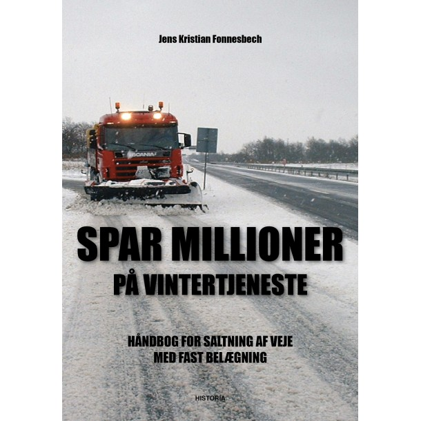
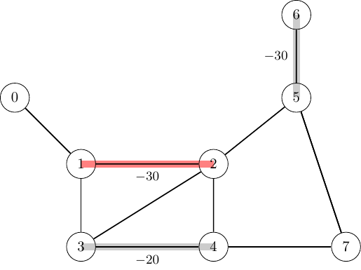
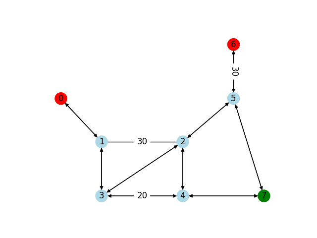
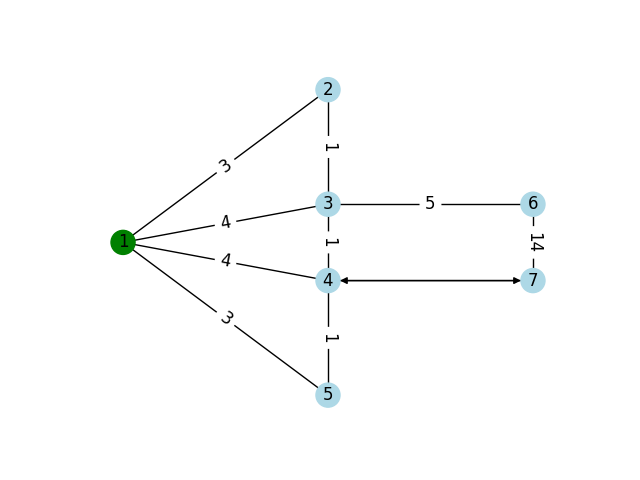

<!--
SPDX-FileCopyrightText: 2024 Marco Chiarandini <marco@imada.sdu.dk>

SPDX-License-Identifier: CC-BY-SA-4.0
-->

<!-- Replace the comment above with your licence information for your problem
statement. Consider all copyright holders and contributors. -->

<!-- According to the copyright and licensing policy of ROAR-NET original
problem statements contributed to this repository shall be licensed under the
CC-BY-4.0 licence. In some cases CC-BY-SA-4.0 might be accepted, e.g., if the
problem is based upon an existing problem licensed under those terms. Please
provide a clear justification when opening the pull request if the problem is
not licensed under CC-BY-4.0 -->

<!-- Remove the section below before submitting 

# Problem template

This folder provides a template for problem statements.

Replace the problem statement below according to the instructions within that
file (and remove this section).

Place any images and figures in the `images` folder.

Place instance data in the `data` folder. The organisation within that folder is
merely a suggestion and may be adapted according to the problem needs.

Place any support material (e.g., instance generators, solution evaluators,
solution visualisers) in the `support` folder.

Template follows below.

---
-->

<!-- Remove the section above before submitting -->

# Salt Spreading

Jens Kristian Fonnesbach, Aiban, Denmark, and Marco Chiarandini, University of Southern Denmark, Denmark

<!-- Put two empty spaces at the end of each author line except the last for
proper formatting -->

Copyright 2025 Marco Chiarandini

This document is licensed under CC-BY-SA-4.0.

<!-- Complete the above accordingly. Copyright and licensing information must be
consistent with the comment at the beggining of the markdown file -->

## Introduction

<!--
In this section provide a brief introduction of the problem, possibly including
its motivation and context. This should be a short (2 or 3 paragraphs)
high-level description.
-->

In the winter season, when forecasts announce temperatures below the freezing
point, municipalities are faced with the task of spreading salt in their road.

The problem and the data described below were provided by Jens Kristian
Fonnesbach, owner of the company [Aiban](https://aiban.dk/) and author of the
book "[Spar Millioner på
Vintertjeneste](https://historia.dk/shop/13-business/90-fonnesbech-spar-millioner-paa-vintertjeneste-2017/)",
2017, Historia.  They are focused on the salt spreading task for the
Danish municipalities of Kerteminde and Middelfart.

<div style="text-align:center;">

</div>

## Task

<!--
Describe the high-level optimisation task in one or two sentences.
-->

Given a road network made of roads that must be salted, roads that can be
transited and directions of transit, given a fleet of salt vehicles with a salt
capacity and refilling depots, we want to find the set of routes that satisfy
salting requirements and minimizes the total travelled distance.  Minimizing the
travelled distance is correlated with accomplishing the salting task with the
least fuel consumption and thus minimal environmental impact (carbon footprint).
In order to be usable in practice the routes must take into account the capacity
of the vehicle. If the salt load is not enough to salt the next road, the
vehicle must visit a refill depot.  Further, there might be constraints on the
shape of the routes to allow easy movements of the vehicles. For example,
U-turns in some parts of the networks are not allowed.

## Detailed description

<!--
Provide a detailed description of the problem in this section. This should
detail what parameters characterise a problem instance, what characterises a
solution, how a solution is evaluated (e.g. an objective function), and solution
feasibility constraints.
-->

We are given a *network* of roads that can be traversed, among which some roads
must be salted. *Vehicles* depart from their respective dwelling place and have
to salt the roads requesting it. The load of salt that the vehicles can carry is
in general insufficient to cover all roads, therefore routes might include
reloading at opportune depots. After having salted the last requested road in
their routes, the vehicles always visit a depot where they are reloaded with
fuel and salt before heading to their dwelling place, ready for the next time.
Further, due to the size of the vehicles and the movements they have to make,
U-turns at some intersections are not allowed.  The total *travelling duration*
for salting the requested roads and finish each route must not exceed a given
amount while the total *travelling distance* of all routes must be minimized. It
is assumed that the vehicles are "off duty" after the final reload.  hence, the
path from the last refilling depot to their dwelling place does not count in the time
duration and in the travelling distance calculation.

<!--
The problem is a generalization of the Capacited Arcs Routing
Problem~\cite{Arc9} with the additional constraints of reloading and
U-turn avoidance.
-->

In the following we specify the problem more formally.

We represent the road network by a *mixed graph* ${G}=(V, E \cup {A})$.  The set
of nodes $V$ includes the set of road intersections, the set of refilling
depots, $D$, and the set of dwelling places to the vehicles, $H$.  The set $E$
is the set of edges that can be traversed in both directions and it includes the
set $E_R$ of edges that must be salted (it is sufficient to salt them in only
one direction). The set of arcs $A$ represents links that can be traversed only
in one direction and it includes the set $A_R$ of arcs required to be salted.

We call *trip* the sequence of edges and arcs visited by a vehicle that departs
from a dwelling place or from a depot and arrives at a dwelling place or at a
depot. A *route* is a sequence of trips that departs from a dwelling place. A
U-turn occurs at a node $v$ when a vehicle visits a node $u$ immediately before
and immediately after $v$, i.e., the vehicle traverses an arc in the opposite
direction of the one it has just traversed.  We denote by $T$ the maximum
allowed time duration for a route.  The *load* of a vehicle is the amount of
salt it carries, which is initially equal to its *capacity*.  The *residual
load* is the amount of salt that the vehicle has after having salted required
roads.  The *refill load* is the amount of salt that a depot can provide to a
vehicle when it visits it.  The *residual capacity* of a vehicle is the
difference between its capacity and its residual load.  The *residual capacity*
must be non-negative at any point in the route.

We denote by $Z$, indexed by $z$, the set of vehicles, by $K$, indexed by $k$,
the set of all trips and by $K_z \subseteq K$ the set of trips composing the
route of the vehicle $z \in Z$.  Each vehicle $z$ has a single dwelling location
$h_z$ from $H$ from which it departs and returns. Every depot has associated a
maximum refill load. After a vehicle has visited a depot we assume its load of
salt to be equal to the smallest between the capacity of the vehicle and the sum
of the maximum refill load of the depot and the residual load before the
visit.  

The task is finding a set of routes such that:

- routes are composed of trips;
- each trip is a sequence of edges and arcs in $E \cup A$;
- each trip starts at a dwelling place or a depot and ends at a depot (note that
  a version of the problem in which the last trip of a route ends just after the last
  salted road, rather than at a refilling depot, is also interesting in practice);
- edges in $E_R$ and arcs in $A_R$ are salted by one vehicle's route;
- the duration of each route is not greater than the given maximum time $T$;
- at any point in the route the residual capacity of the vehicle is non-negative;
- there are no U-turns at nodes where they are not allowed;

and such that it minimizes the total length.

## Instance data file

<!--
Describe the format of a problem instance file.
-->

We provide two real-life instances and two examples. The real-life instances are
provided by the company Aiban and relate to the two Danish municipalities of
Kerteminde and Middelfart. We make available the original spreadsheet as well as
the post processed `json` format, which is going to be the standard format of
this problem statement.

See a description and details:

- [Kerteminde](data/kerteminde/description.md)
- [Middelfart](data/middelfart/description.md)

Using a simplified syntax, the `json` files contain data organized as follows:

```json
{
    "name",
    "max_time",
    "nodes": [{"label", "position": ["x", "y"]}]
    "vehicles": [{"id", "capacity", "home"}],
    "depots": [{"label", "refill"}],
    "A": [{"arc": ["from", "to"], "len", "time"}],
    "A_R": [{"arc": ["from", "to"], "dem", "len", "time"}],
    "E_R": [{"edge": ["from", "to"], "dem", "len", "time"}],
    "U": [{"label"}]
}
```

Note that the instance does not contain an object for the edge set $E$ as every
edge in this set can be replaced by two arcs in opposite direction in the set
$A$.

The formal [schema](support/schema.json) for validation of the `json` instances is
available in the `support` folder. See also a small example for the instance
[gualandi](data/gualandi/gualandi.json) described below.

## Solution file

<!-- Describe the format of a solution file. -->

The solution file must also be a json file and there are two formats.

The first format contains an array of elements
corresponding to routes. Each element is a dictionary containing the identifier
of the vehicle and the route expressed as the sequence of visited nodes. The
json schema is available at [schema_solution_nodes.json](support/schema_solution_nodes.json).

An example is:

```json
[
    {
        "id": "1",
        "route": ["1", "2", "3", "4", "5"]
    },
    {
        "id": "2",
        "route": ["6", "7", "8", "9"]
    }
]
```

The second format contains a list of dictionaries one for each vehicle.
Vehicles' dictionaries contain the ide of the vehicle and the route made of
trips specified by the arcs that must be traversed and by whether salt must be
spread or not. The json schema is available at
[schema_solution_arcs.json](support/schema_solution_arcs.json).

```json
[
    {
        "vehicle":"1",
        "route":[
            {"arc":["1","3"],"salted":false},{"arc":["3","6"],"salted":false},{"arc":["6","7"],"salted":true},{"arc":["7","4"],"salted":false},{"arc":["4","1"],"salted":false}
        ]
    },
    {
        "vehicle":"2",
        "route": [
            {"arc":["1","3"],"salted":false},{"arc":["3","2"],"salted":false},{"arc":["2","1"],"salted":true},{"arc":["1","3"],"salted":true},{"arc":["3","2"],"salted":false},{"arc":["2","1"],"salted":false},{"arc":["1","4"],"salted":true},{"arc":["4","5"],"salted":false},{"arc":["5","1"],"salted":true},{"arc":["1","3"],"salted":false},{"arc":["3","2"],"salted":true},{"arc":["2","1"],"salted":false},{"arc":["1","4"],"salted":false},{"arc":["4","3"],"salted":true},{"arc":["3","1"],"salted":false},{"arc":["1","4"],"salted":false},{"arc":["4","7"],"salted":false},{"arc":["7","6"],"salted":false},{"arc":["6","3"],"salted":true},{"arc":["3","4"],"salted":false},{"arc":["4","5"],"salted":true},{"arc":["5","1"],"salted":false}
        ]
    }
]
```

Note that nodes are identified by label strings.

## Example

### Instance

<!-- Provide a small example instance in the described format. -->

There are two small instances that can be used as examples.
Here, we present one of them:

<!--
{ width="515" height="385" style="display:
block; margin: 0 auto; text-align: center" }
-->

<div style="text-align: center;">

</div>

Another small example is:

<div style="text-align: center;">

</div>

### Solution

<!--
Provide a feasible solution to the example instance in the described format
(including its evaluation measure).
-->

For the first of the two examples, a candidate solution is:

```json
[
  {"vehicle":"1",
  "route":[
    {"arc":["0","1"],"salted":false},
    {"arc":["1","2"],"salted":true},
    {"arc":["2","3"],"salted":false},
    {"arc":["3","4"],"salted":true},
    {"arc":["4","7"],"salted":false},
    {"arc":["5","6"],"salted":false},
    {"arc":["6","5"],"salted":true},
    {"arc":["5","7"],"salted":false}
  ]
  }
]
```

is feasible and has total length 60.

<!--
### Explanation
-->
<!-- Optionally, provide a -->
<!--
Descriptive and/or visual explanation of the solution (and
its evaluation measure value) for the instance.
-->

## Acknowledgements

This problem statement is based upon work from COST Action Randomised
Optimisation Algorithms Research Network (ROAR-NET), CA22137, is supported by
COST (European Cooperation in Science and Technology).

The problem statement was originally presented by Jens Kristian Fonnesbach. One
small unpublished example is due to Stefano Gualandi from the University of
Pavia. The other example is due to Belenguer and Benavent, see reference below.

<!-- Please keep the above acknowledgement. Add any other acknowledgements as
relevant. -->

## References

- Jens Kristian Fonnesbach, "[Spar Millioner på
  Vintertjeneste. Håndbog for Saltning af Veje med Fast Belægning](https://historia.dk/shop/13-business/90-fonnesbech-spar-millioner-paa-vintertjeneste-2017/)",
  2017, Historia.

- Belenguer, José M.; Benavent, Enrique "A cutting plane algorithm for the
  capacitated arc routing problem" Computers & operations research , 04/2003,
  Volume 30, Issue 5
