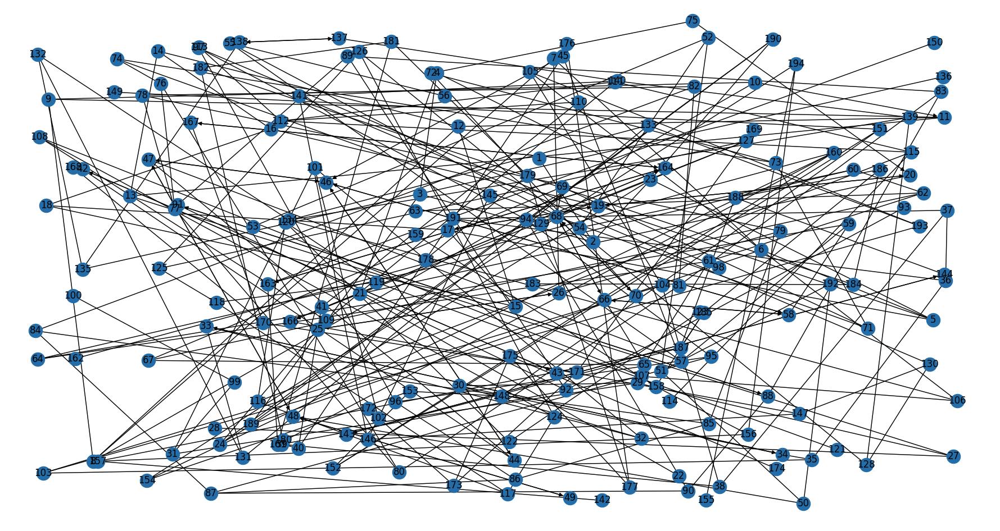
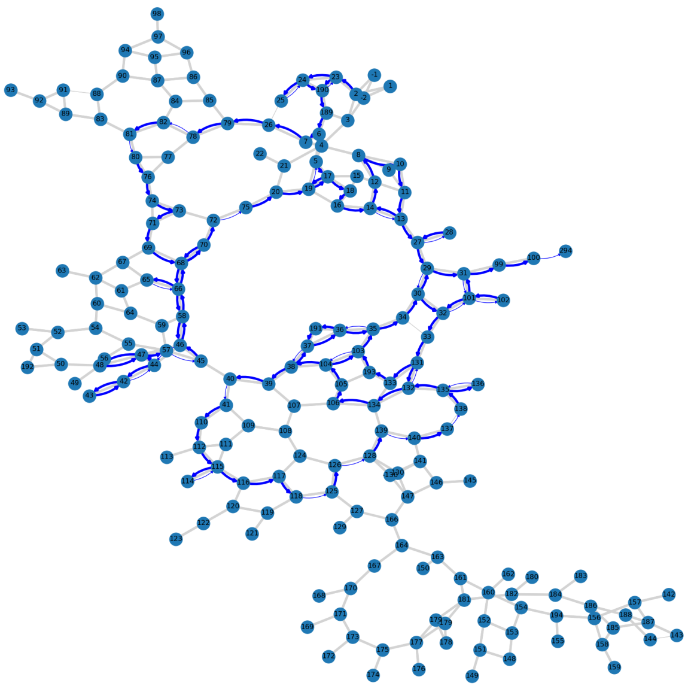
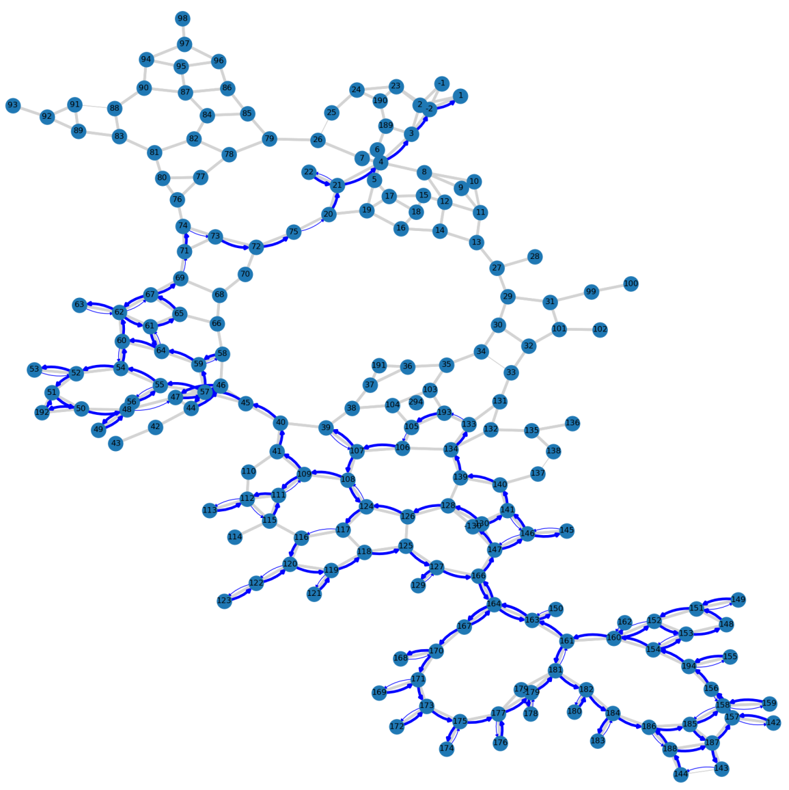
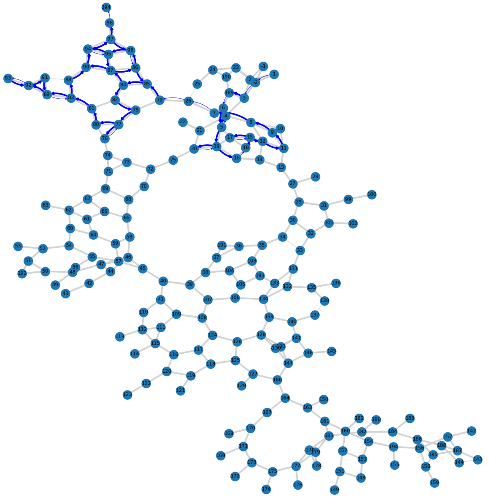

<!--
SPDX-FileCopyrightText: 2024 Marco Chiarandini <marco@imada.sdu.dk>

SPDX-License-Identifier: CC-BY-SA-4.0
-->

# Kerteminde Instance

## The Spreadsheets

Each node (column `Knude punkt`) represents a road intersection and at each
node it is given a set of edges (roads) departing from that node (the adjacency
list representation of $G$). The
column `status` indicates whether an edge needs to be salted and in
which direction. A status of 1 indicates that the corresponding edge needs to be
salted but the direction is free. A status of 2 indicates that the edge
must be salted in a predefined direction. A status of 3 indicates that
the edge does not need to be salted. We assume that all edges listed can
be traversed in both directions.
<!-- {\mc{I need to ask to the company if this is true.} -->

Each edge has a column indicating the length of the road (`længde`) and a column
indicating the breadth of the road (`salt m`), both represented in meters and
calculated with one decimal.  The vehicles are identical. They have a salt
capacity of $12.3 \mathrm{m}^3$ and they spread $30\textrm{ml}$ of salt per
$\mathrm{m}^2$ of road. Since, $1\textrm{ml} = 1
\mathrm{cm}^3=10^{-6}\mathrm{m^3}$, on each road segment of length $\ell$ and
width $w$ (expressed in $\mathrm{m}$ they use $30\cdot 10^{-6} \cdot \ell \cdot
w\mathrm{m}^3$ of salt). The depots are in node 1 and in node 179 and the two
drivers start and end at their dwelling places at node 2 and 130, respectively.
The vehicles have speed 65 km/h both when salting and when deadheading. The
salting of the roads has to be completed within 3.5 hours and the overall
objective is to minimise the total traveled distance. 

<!-- The drivers visit a depot before returning to their dwelling place with their
vehicles, therefore they start with a full cargo hold of salt and fuel
tanks. The path from the depot to dwelling place does not count in the traveling
time and distance. -->

## Instance Statistics

- $|V|$=193, $|A|$=10, $|A_R|$=33, $|E_R|$= 233
- 265.602 total sum of lengths of the arcs and edges to salt
- 21.450 total sum of lengths of the deadhead arcs available
- 1.018.806 total required demand
- 820.000 total capacity
- 33 U-turn-allowed nodes

- unconfirmed lower bound: 271.511

The data in the spreadsheet does not include the coordinates of the road
intersections, thus the precise map reconstruction is not possible. For the
Kerteminde instance we have available a series of [maps](./maps/) that
indicate the position of the points. However, in the `.json` format that we
provide the coordinates are an approximate reconstruction achieved with
multidimensional scaling on the basis of the road lengths. Those coordinates
have no geographical correspondence. They give rise to the following plot:

## Solutions

