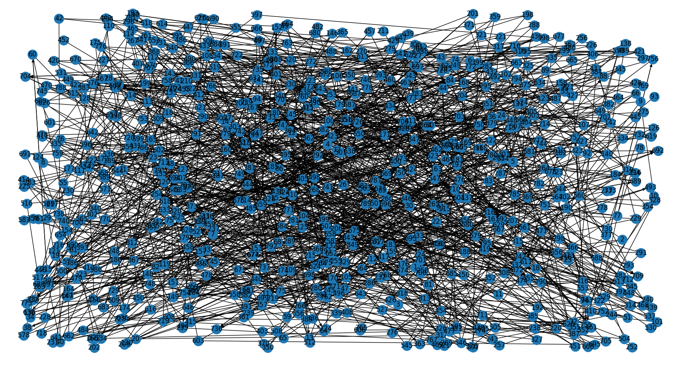

<!--
SPDX-FileCopyrightText: 2024 Marco Chiarandini <marco@imada.sdu.dk>

SPDX-License-Identifier: CC-BY-SA-4.0
-->

# Middelfart Instance

The instance bears the same characteristics as the Kerteminde instance. See the
description under that instance for details.

## Instance Statistics

- $|V|$=784, $|A|$=56, $|A_R|$=62, $|E_R|$= 1004
- 40.280 total sum of lengths of the deadhead arcs available
- 544.198 total sum of lengths of the arcs and edges to salt
- 1.929.260 total required demand
- 1.230.000 total capacity
- 149 U-turn-allowed nodes

- unconfirmed lower bound: 545.805.

