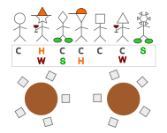
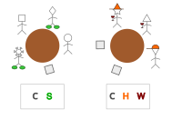
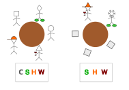

<!--
SPDX-FileCopyrightText: 2025 Andreia P. Guerreiro <andreia.guerreiro@tecnico.ulisboa.pt>

SPDX-License-Identifier: CC-BY-4.0
-->


# Seat Arragement Problem

This is an adapted version of the problem proposed in [1].

Andreia P. Guerreiro, INESC-ID, Lisbon, Portugal


Copyright 2025 Andreia P. Guerreiro

This document is licensed under CC-BY-4.0
<!-- The original problem in [1] is also licensed under CC-BY-4.0 according to the information here: https://researchportal.helsinki.fi/en/publications/maxsat-evaluation-2017-solver-and-benchmark-descriptions  -->


## Introduction

Using an algorithm to solve the seat arrangement problem of a wedding (or, for example, of the Christmas dinner of a company) is a great way to avoid being held responsible for guest discontentment, as you can always blame the algorithm if someone is unhappy with his/her seat (e.g., uncle Tony would be much happier if his wife was in a different table so that he could eat all the cheese in peace without hearing her grumble about it!).


## Task

The goal is to assign guests to tables while maximising the overall affinity between the guests sharing the same table. To measure affinity, labels are associated to each guest to characterise them with respect to aspects such as spoken language, last family name, university attended, etc. Guests with disagreements must be assigned to different tables. To reflect the fact that some aspects are more important than others, a weight is associated to each label.

## Detailed description

There are $G$ guests, $T$ tables, and $L$ labels. Each table must be assigned a number of guests between $\ell$ and $u$. To each guest $g \in \{1,\ldots,G\}$  is associated a list of labels $L_g$ such that $L_g \subseteq\{1,\ldots,L\}$ and $|L_g| \geqslant 1$. To each label $b\in \{1,\ldots,L\}$ is associated a weight $w_b\in \{1,\ldots, 10\}$.

Disagreements are represented by a list of pairs $D$, where $(g_1,g_2)\in D$ indicates that guests $g_1$ and $g_2$ ($g_1,g_2\in\{1,\ldots,G\}$) cannot sit at the same table.

A solution is represented by the vector $x = (x_1,\ldots,x_G)$  where $x_g\in\{1,\ldots,T\}$ for all $g\in\{1,\ldots,G\}$ stores the table number to which each guest $g$ is assigned to.

Note that the seat arrangement within each table does not matter.

<!-- The goal is to minimise the number of different labels across every table. The wedding problem can be formalised as follows: -->
The goal is to minimise the overall sum of the cost of the tables, where such cost is given by the sum of the weights of the labels present at each table. Assuming that the auxiliary variable $y_{t,b}$, where $t\in\{1,\ldots,T\}$ and $b\in\{1,\ldots,L\}$, indicates whether someone at table $t$ has label $b$ (i.e., $y_{t,b}=1$ iff $\exists_{g\in\{1,\ldots, G\}} x_g = t, b\in L_g$), the wedding problem can be formalised as follows:

<!-- \min_{x\in\{1,\ldots,T\}^G} & \qquad & \sum_{t\in\{1,\ldots,T\}} |\{b  \in L_g \:|\: x_g=t, 1 \leqslant g \leqslant G \}| & & \\ -->
$$
\begin{align*}
\min_{x\in\{1,\ldots,T\}^G} & \qquad & \sum_{t\in\{1,\ldots,T\}} \sum_{b\in\{1,\ldots,L\}} w_b y_{t,b} & & \\
\text{s.t.} & & \ell \leqslant|\{g\in\{1,\ldots,G\} |x_g=t\}| \leqslant u & \qquad & t=1, \ldots, T\\
& & x_{g_1} \neq x_{g_2}, & & (g_1,g_2) \in D\\
\end{align*}
$$

## Instance data file

The input file contains several lines with several numbers separated by white spaces.
The file may contain lines with comments. Such lines start with a cardinal (`#`) and must be ignored during parsing.

- The first line contains six values: $G$, $T$, $L$, $|D|$, $\ell$ and $u$;
- The second line contains $L$ values representing the weights of the labels;
- Each of the following $G$ lines contains the list of labels associated to each of the guests, where the size of such lists are not necessarily the same;
- Each of the following $|D|$ lines contains two values, representing the indices of two guests which have a disagreement.

*Note*: Consider that the label indices (and the table indices) start in 0 instead of 1.

## Solution file

The solution file must contain a single line with $G$ values, separated by white spaces, representing the solution vector $x$.

## Example

Consider the following example with $G=7$ guests and $T=2$ tables, where $\ell=2$ and $u=5$.  There are $L=4$ labels:

 - Convex-shaped head (C)
 - Wears shoes (S)
 - Wears hats (H)
 - Drinks wine (W)
 
 The following figures illustrates the problem. The labels associated to each guest are listed below the guest.

 

###  Instance 1 (No disagreements)

Consider that labels C, S, H, and W are presented by integer numbers from 0 to 3, respectively. The above example is then represented by:

```
# 7 guests, 2 tables, 4 labels, 0 disagreements, 2 to 5 guests per table
7 2 4 0 2 5
# Label weight (Labels: C, S, H, W)
10 2 1 1
# Labels associated to each guest
0
2 3
0 1
0 2
0
0 3
1
```

### Solution 1

A feasible solution for this example is:
```
0 1 0 1 0 1 0
```

And the corresponding objective value is `24`. 

#### Explanation

The following illustration of this solution shows, below each table, the labels of the guests in that table. The first table has labels C and S and since their weights are 10 and 2 respectively, the cost of the table is 12. The second table has labels C, H, and W, with weights 10, 1 and 1, respectively, and therefore, has a cost of 12. The objective value is the sum of these costs, that is, 12+12=24.

 

### Solution 2

Another feasible solution for this example is:
```
0 1 0 0 0 0 1
```
And the corresponding objective value is `18`.

#### Explanation

The first table has all labels and, consequently, a cost of 14. The second table has labels S, H, and W, with weights 2, 1 and 1, respectively, and therefore, has a cost of 4. The objective value is the sum of these costs, that is, 14+4=18.

 

### Instance 2 (With disagreements)

The same example of instance 1 but now considering that there is a disagreement between guests 1 and 5:

```
# 7 guests, 2 tables, 4 labels, 1 disagreement, 2 to 5 guests per table
7 2 4 1 2 5
# Label weight (Labels: C, S, H, W)
10 2 1 1
# Labels associated to each guest
0
2 3
0 1
0 2
0
0 3
1
# Disagreements
1 5
```

In this case, solution 1 is not feasible, whereas solution 2 (with objective value of 18) is feasible.

## Acknowledgements

This problem statement is based upon work from COST Action Randomised
Optimisation Algorithms Research Network (ROAR-NET), CA22137, is supported by
COST (European Cooperation in Science and Technology).

<!-- Please keep the above acknowledgement. Add any other acknowledgements as
relevant. -->

The author acknowledges the financial support from FCT through 2022.08367.CEECIND/CP1717/CT0001.

## References

[[1](https://tuhat.helsinki.fi/ws/portalfiles/portal/94102129/mse17proc.pdf#page=25)] Martins, R., & Sherry, J. (2017). "Lisbon Wedding: Seating Arrangements using MaxSAT". MaxSAT Evaluation, 25-26.
